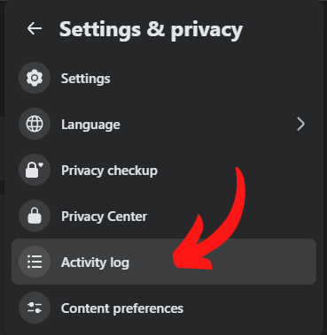
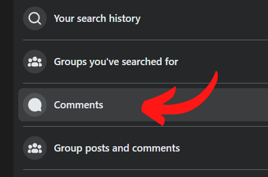

# Facebook Comments Deleter
**Automate the tedious task of clearing your digital footprint.**
A simple browser-based script that automatically deletes your Facebook comments one by one. It’s secure, no need to share your password or grant special permissions, and includes random delays to mimic human behavior, making it less likely to be flagged as a bot.

## Steps

1. Click your profile picture in the top-right corner  
2. Go to **Settings & Privacy**

  

3. Open **Activity Log**  

  

4. Select **Comments**  

  

5. Press **F12**, or right-click anywhere on the page and choose **Inspect**  
6. In the tabs, click **>>** and select **Sources**  
7. In the second row of tabs (Page, Workspace, etc.), click **>>** again and choose **Snippets**  

  

8. Click **+ New snippet**, then paste the full script from `snippet.js` into the editor on the right  
9. Hit **Ctrl + Enter** (or click **Run snippet**) and let it do its thing

  

10. To pause the automation, click the "Pause script execution" button in the Sources tab or use the F8 shortcut. Once you are finished, simply close the browser tab; no manual cleanup is required.

  

## Notes

- You can tweak the `repeatCount` value to delete more or fewer comments.  
- You can also adjust the jitter and delay settings if needed, but it’s best to leave them as-is unless you know what you’re doing.  

## Compatibility

- Tested on Brave browser. It should work on other browsers as well.  
- Let me know if you run into any issues.

## License
This project is licensed under the **MIT License**.
Developed by **Lee Zhi Eng** Visit my website for more tools and projects: [zhieng.com](https://www.zhieng.com)
