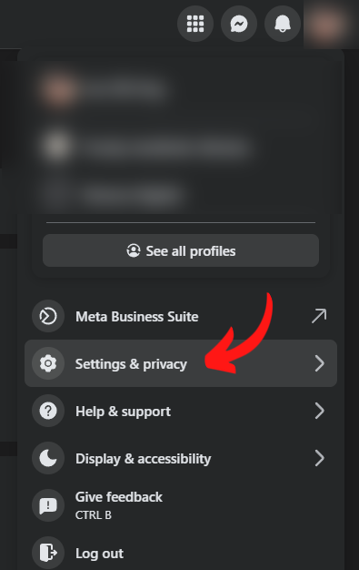
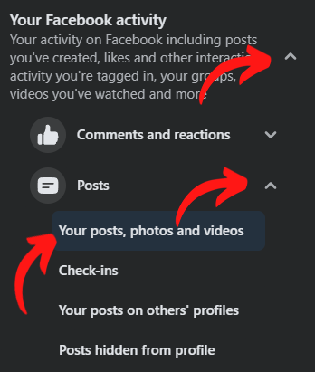
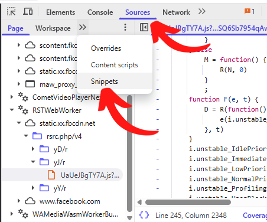
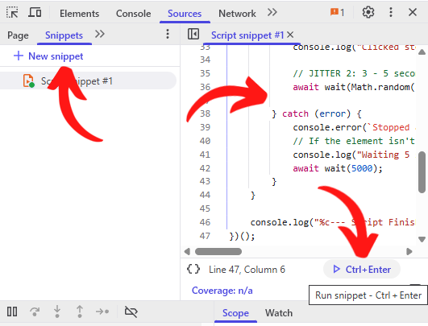
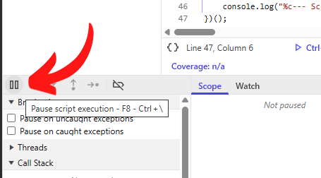
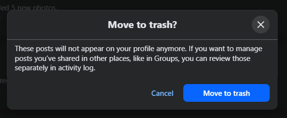

# Facebook Posts Deleter
**Automate the tedious task of clearing your digital footprint.**

A simple browser-based script that automatically deletes your Facebook posts by bulk. It’s secure, no need to share your password or grant special permissions, and includes random delays to mimic human behavior, making it less likely to be flagged as a bot.

Run the script and leave the tab visible to see the automation in action. Because this tool prioritizes account safety by simulating human behavior, large-scale deletions are processed gradually. For best results, keep your browser open until the task is complete.

## Steps

1. Click your profile picture in the top-right corner  
2. Go to **Settings & Privacy**

  

3. Open **Activity Log**  

  

4. Select **Your Facebook activity** > **Posts** > **Your posts, photos and videos**

  

5. Press **F12**, or right-click anywhere on the page and choose **Inspect**  
6. In the tabs, click **>>** and select **Sources**  
7. In the second row of tabs (Page, Workspace, etc.), click **>>** again and choose **Snippets**  

  

8. Click **+ New snippet**, then paste the full script from `snippet.js` or `snippet_bulk.js` into the editor on the right  
9. Click the **Run snippet - Ctrl + Enter** button and let it do its thing

  

10. To pause the automation, click the **Pause script execution** button in the **Sources** tab or use the F8 shortcut. Once you are finished, simply close the browser tab, no manual cleanup is required.

  

## Why the screen scroll up and down repeatedly throughout the process?

Don’t worry, this is completely normal. The reasons are as follows:

**Scroll down**

- When the screen moves downward after posts are deleted, it is loading more posts.
- Facebook requires the page to scroll to the bottom in order to load additional posts.

**Scroll up**

- After selecting all posts based on your chosen options, the system needs to click the **Trash** button located at the top of the page.
- Without scrolling back to the top, the confirmation dialog will not appear.

  

## Notes

- You can adjust the `sharedPost`, `sharedLink`, `addedPhoto`, `updatedStatus`, and `taggedByOthers` values to target the specific post types you want to delete. These options are disabled by default.
- You must set the `username` value to match your profile username shown at the end of your profile URL, for example: https://facebook.com/yourusername
- The `maxSelection` value determines how many posts will be selected in each round.
- The `repeatCount` value determines how many times the script will repeat the cycle. Use a large number such as 99999 if you want it to continue running until you stop it manually.
- You can also adjust the jitter and delay settings if needed, but it’s best to leave them as-is unless you know what you’re doing.
- Please do not minimize the browser window. Facebook’s dynamic UI relies on active rendering to trigger the "infinite scroll" that loads older history items. If the window is minimized, the script may throw a "Could not find element" error because the next set of posts has failed to load into the DOM.

## Compatibility

- Tested on Brave browser. It should work on other browsers as well.  
- Let me know if you run into any issues.
- The script is designed for the current social media layout, as it functions as an auto-clicker and relies heavily on the webpage structure. It may stop working if the layout changes.

## License
This project is licensed under the **MIT License**. 
Developed by **Lee Zhi Eng** Visit my website for more tools and projects: [zhieng.com](https://www.zhieng.com)
